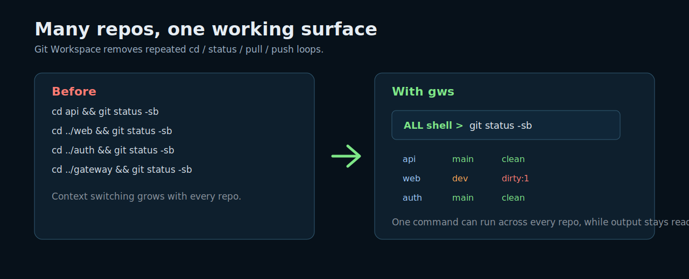
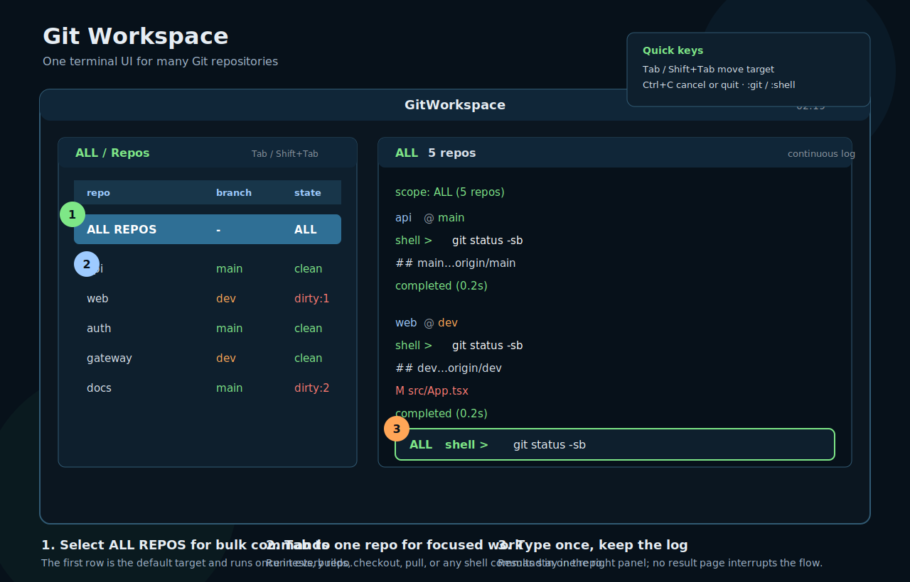
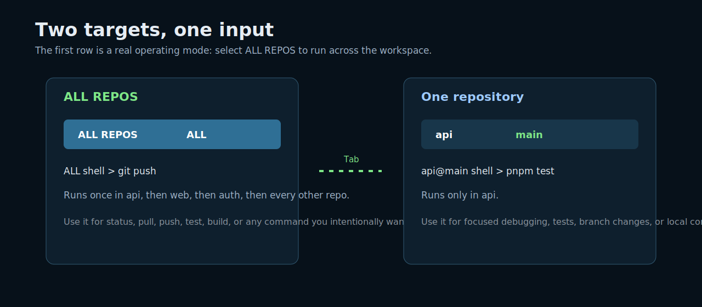
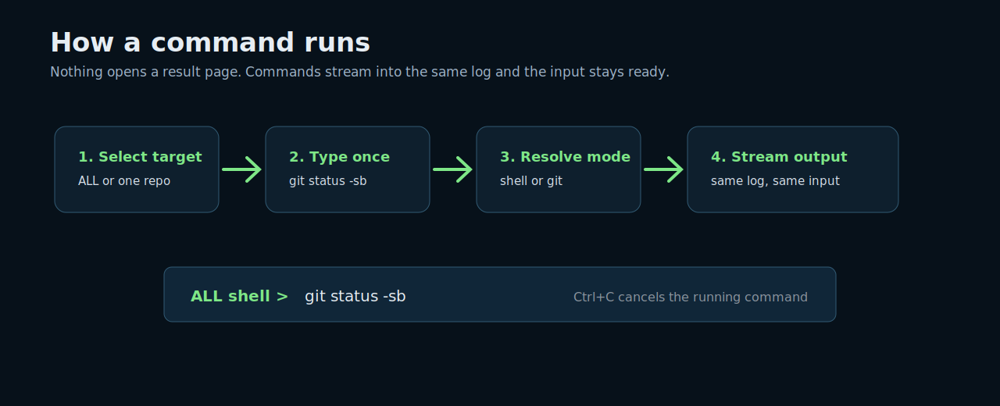
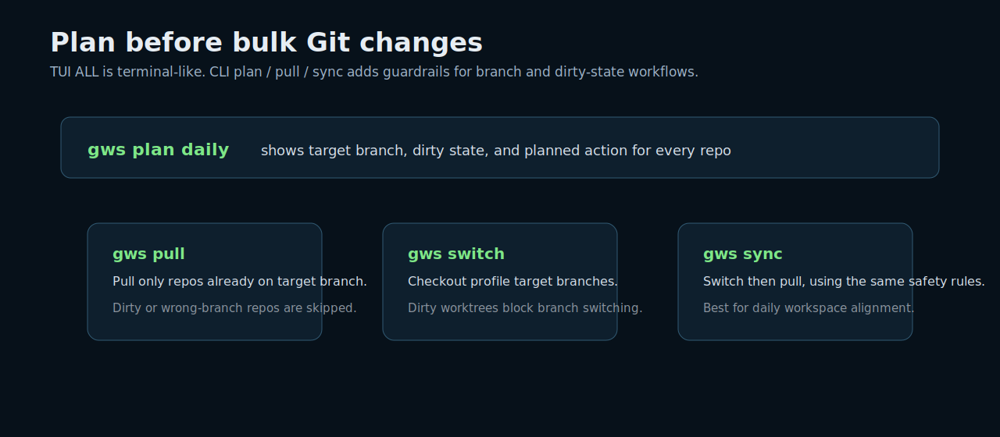
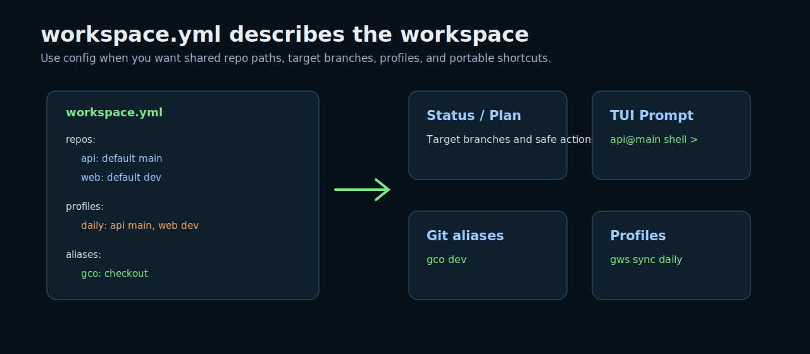

# Git Workspace

[中文文档](README.zh-CN.md)

Git Workspace (`gws`) is a Git-aware multi-repo terminal. It is built for one common developer setup: a single directory that contains many Git repositories.



## 60-Second Start

Install from PyPI:

```bash
uv tool install git-workspace-tui
```

Open the directory that contains your repos:

```bash
cd ~/Projects/workspace
gws
```

Inside the TUI, the first row is `ALL REPOS`. Type once there to run in every repo:

```text
ALL shell > git status -sb
```

Press `Tab` to move to one repo and run a focused command:

```text
api@main shell > pnpm test
```

## TUI Map



The TUI has only two concepts:

| Area | Meaning |
| --- | --- |
| Left panel | Choose the target: `ALL REPOS` or one repository. |
| Right panel | Continuous command log and one command input. |

Useful keys:

| Key | Action |
| --- | --- |
| `Tab` / `Shift+Tab` | Move through `ALL REPOS` and repository rows. |
| `Enter` | Run the input in the selected target. |
| `Up` / `Down` | Command history. |
| `Ctrl+C` | Cancel running command, or quit when idle. |
| `Ctrl+Q` | Quit. |
| `:git` / `:shell` | Switch execution mode. |
| `:clear` / `:refresh` | Clear log / refresh repos. |

## ALL REPOS vs One Repo



`ALL REPOS` is a real operating target, not a hidden mode.

```text
ALL shell > git status -sb
ALL shell > git pull --ff-only
ALL shell > git push
```

Repository rows are for focused work:

```text
api@main shell > pnpm test
api@main shell > git checkout dev
api@dev shell > git pull --ff-only
```

## Command Flow



Default mode is `shell`, so Git Workspace runs commands through your configured shell in the target repo directory.

```text
ALL shell > git status -sb
web@dev shell > npm run build
```

Use Git mode when you want shorter Git subcommands and Git aliases:

```text
:git
ALL git > status -sb
api@main git > gco dev
:shell
```

Shell aliases and functions are loaded best-effort. Portable team shortcuts should go in `workspace.yml` or Git's own `alias.*` config.

## CLI Safety Flow



The TUI `ALL REPOS` target is terminal-like: it runs the command you type in every repo.

For safer branch / pull workflows, use the plan-aware CLI commands:

```bash
gws status
gws plan daily
gws switch daily
gws pull daily
gws sync daily
```

Command meanings:

| Command | Purpose |
| --- | --- |
| `status` | Show branch, target, dirty state, upstream, ahead / behind. |
| `plan` | Explain actions before changing anything. |
| `switch` | Checkout target branches when safe. |
| `pull` | Pull clean repos already on target branch. |
| `sync` | Switch to target branches, then pull safe repos. |
| `exec` | Run a shell command across repos. |

Run any command across repos from the CLI:

```bash
gws exec -- pwd
gws exec -- git status -sb
gws exec daily -- pnpm test
```

## Configuration Model



Git Workspace works without a config by discovering Git repositories directly under the current directory. Add `workspace.yml` when you want shared defaults.

```yaml
workspace:
  root: .
  ignore:
    - node_modules
    - .cache
    - dist

repos:
  api:
    path: ./api
    default: main
  web:
    path: ./web
    default: dev

profiles:
  daily:
    api: main
    web: dev
    "*": main

aliases:
  gco: checkout
  gcb: checkout -b
  gl: pull
  gp: push

exec:
  defaultMode: shell
  gitShortcuts: true
  shell:
    interactive: true
```

Use `workspace.local.yml` for machine-specific overrides. It should usually stay uncommitted.

## Install Options

The PyPI package name is `git-workspace-tui`. The installed commands are `gws` and `g`.

With `uv`:

```bash
uv tool install git-workspace-tui
```

With `pipx`:

```bash
pipx install git-workspace-tui
```

Upgrade an existing install:

```bash
uv tool upgrade git-workspace-tui
```

If you installed with `pipx`:

```bash
pipx upgrade git-workspace-tui
```

Install a specific PyPI version:

```bash
uv tool install 'git-workspace-tui==0.1.0'
```

Install a fixed version from GitHub:

```bash
uv tool install git+https://github.com/liusheng22/git-workspace.git@v0.1.0
```

From a local clone:

```bash
git clone https://github.com/liusheng22/git-workspace.git
cd git-workspace
uv sync --dev
uv run gws --help
```

`g` is also installed as a short alias for `gws`:

```bash
g
g status
g plan
```

## Safety Notes

- `ALL REPOS` runs your command in every repo. It intentionally behaves like a multi-repo terminal.
- `plan`, `pull`, and `sync` inspect branch and dirty state before changing repositories.
- Dirty worktrees are not auto-fixed.
- Unsafe branch switching is skipped.

When in doubt:

```bash
gws status
gws plan
```

## Development

```bash
uv sync --dev
uv run pytest
uv run ruff check .
uv run python -m build
```

## Release Process

Releases are published to PyPI by GitHub Actions when a version tag is pushed.

```bash
# after updating pyproject.toml, uv.lock, CHANGELOG.md, and docs
uv lock
uv run ruff check .
uv run pytest
uv run python -m build
git commit -am "chore: release vX.Y.Z"
git push origin main
git tag -a vX.Y.Z -m "vX.Y.Z"
git push origin vX.Y.Z
```

The publish workflow uses PyPI Trusted Publishing with repository `liusheng22/git-workspace`, workflow `publish.yml`, and environment `pypi`. PyPI versions are immutable, so a failed or incorrect release must be fixed by publishing a new version.

See [docs/releasing.md](docs/releasing.md) for the full maintainer checklist.

Git Workspace currently targets macOS and Linux.
