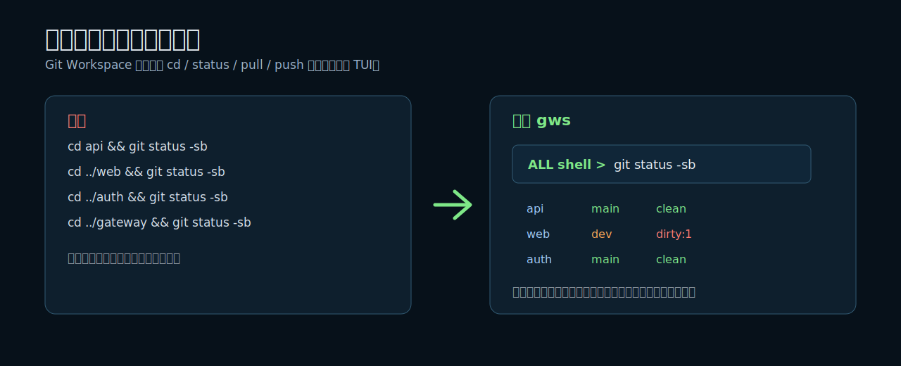
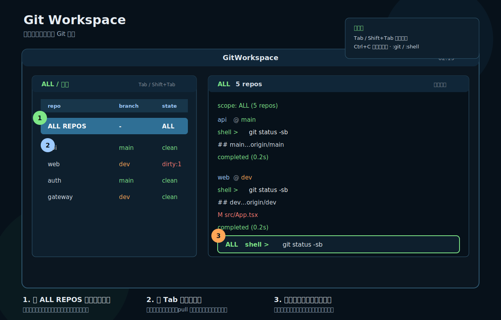
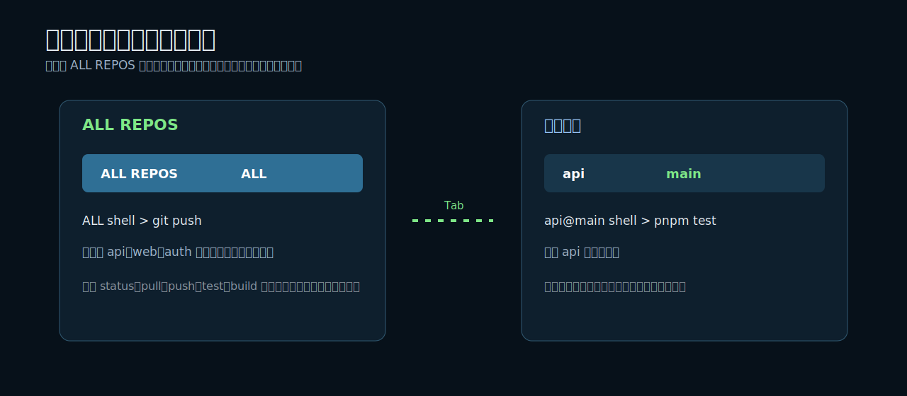
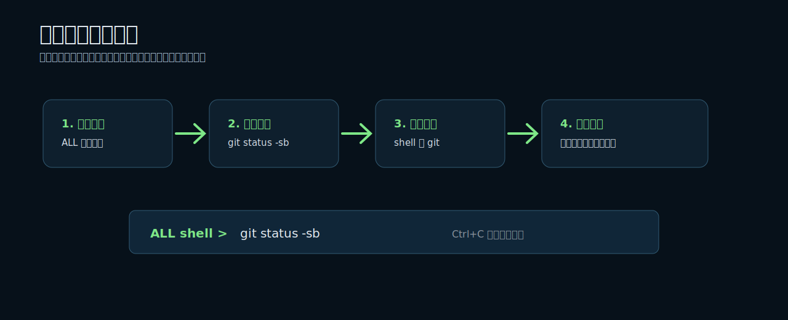
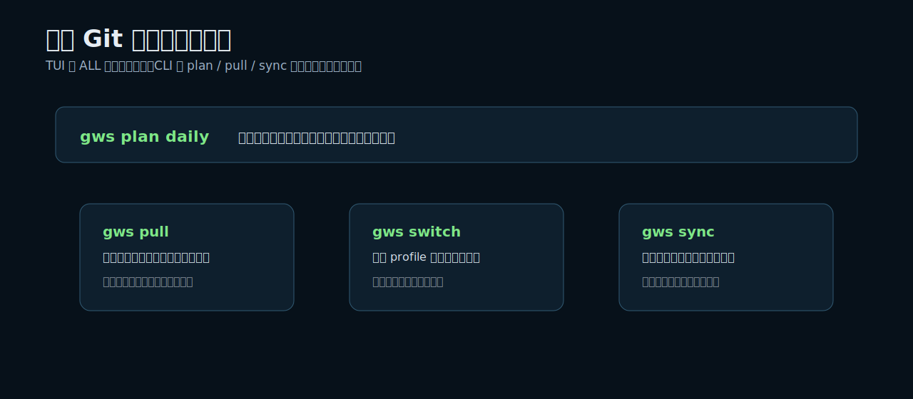
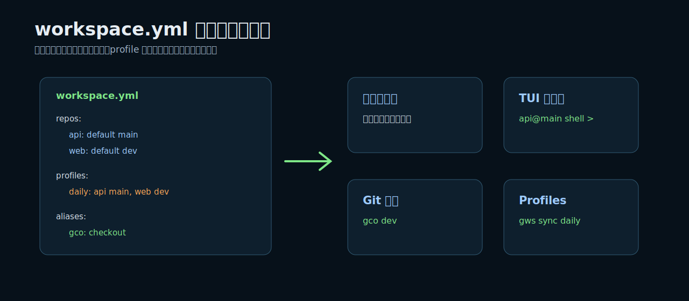

# Git Workspace

[English](README.md)

Git Workspace (`gws`) 是一个面向多 Git 仓库目录的终端工作台。它适合这种工作方式：一个目录下面放了很多 Git 项目，你经常要在这些仓库之间查看状态、pull、push、切分支、跑测试或构建。



## 60 秒上手

通过 GitHub 安装：

```bash
uv tool install git+https://github.com/liusheng22/git-workspace.git
```

进入你的多仓库目录：

```bash
cd ~/Projects/workspace
gws
```

进入 TUI 后，第一行是 `ALL REPOS`。在这里输入命令，会依次在所有仓库里执行：

```text
ALL shell > git status -sb
```

按 `Tab` 移动到某个仓库行，就只在那个仓库里执行：

```text
api@main shell > pnpm test
```

## TUI 界面说明



这个界面只有两个核心区域：

| 区域 | 含义 |
| --- | --- |
| 左侧 | 选择执行目标：`ALL REPOS` 或某一个仓库。 |
| 右侧 | 连续命令日志 + 一个输入框。 |

常用快捷键：

| 快捷键 | 作用 |
| --- | --- |
| `Tab` / `Shift+Tab` | 在 `ALL REPOS` 和仓库行之间移动。 |
| `Enter` | 在当前选中的目标里执行输入框命令。 |
| `Up` / `Down` | 命令历史。 |
| `Ctrl+C` | 有命令运行时取消命令；空闲时退出。 |
| `Ctrl+Q` | 退出。 |
| `:git` / `:shell` | 切换 Git 模式 / shell 模式。 |
| `:clear` / `:refresh` | 清空日志 / 刷新仓库状态。 |

## ALL REPOS 和单仓库



`ALL REPOS` 是一个明确的执行目标，不是隐藏开关。

```text
ALL shell > git status -sb
ALL shell > git pull --ff-only
ALL shell > git push
```

仓库行用于单仓库操作：

```text
api@main shell > pnpm test
api@main shell > git checkout dev
api@dev shell > git pull --ff-only
```

## 命令是怎么执行的



默认是 `shell` 模式，所以输入的命令会通过你的默认 shell，在目标仓库目录里执行。

```text
ALL shell > git status -sb
web@dev shell > npm run build
```

如果你想输入更短的 Git 子命令或 Git alias，可以切到 Git 模式：

```text
:git
ALL git > status -sb
api@main git > gco dev
:shell
```

shell alias / function 会尽量加载，但这是 best-effort。团队共享的 Git 快捷命令建议放到 `workspace.yml` 或 Git 自己的 `alias.*` 配置里。

## CLI 安全工作流



TUI 里的 `ALL REPOS` 更像“多仓库终端”：你输入什么，就在每个仓库里执行什么。

如果要做更安全的分支 / pull 工作流，用 CLI 的 plan-aware 命令：

```bash
gws status
gws plan daily
gws switch daily
gws pull daily
gws sync daily
```

命令含义：

| 命令 | 用途 |
| --- | --- |
| `status` | 查看每个仓库的分支、目标分支、脏状态、upstream、ahead / behind。 |
| `plan` | 在修改仓库前先解释将要做什么。 |
| `switch` | 在安全时切到目标分支。 |
| `pull` | 只拉取已经在目标分支上的干净仓库。 |
| `sync` | 先切目标分支，再拉取安全仓库。 |
| `exec` | 跨仓库执行 shell 命令。 |

不进 TUI，也可以直接跨仓库执行命令：

```bash
gws exec -- pwd
gws exec -- git status -sb
gws exec daily -- pnpm test
```

## 配置模型



没有配置文件时，Git Workspace 会自动发现当前目录下的直接子 Git 仓库。需要团队共享默认分支、profile、忽略规则和别名时，可以创建 `workspace.yml`。

```yaml
workspace:
  root: .
  ignore:
    - node_modules
    - .cache
    - dist

repos:
  api:
    path: ./api
    default: main
  web:
    path: ./web
    default: dev

profiles:
  daily:
    api: main
    web: dev
    "*": main

aliases:
  gco: checkout
  gcb: checkout -b
  gl: pull
  gp: push

exec:
  defaultMode: shell
  gitShortcuts: true
  shell:
    interactive: true
```

`workspace.local.yml` 可以放本机私有覆盖配置，通常不应该提交到 Git。

## 安装方式

使用 `uv`：

```bash
uv tool install git+https://github.com/liusheng22/git-workspace.git
```

使用 `pipx`：

```bash
pipx install git+https://github.com/liusheng22/git-workspace.git
```

本地源码运行：

```bash
git clone https://github.com/liusheng22/git-workspace.git
cd git-workspace
uv sync --dev
uv run gws --help
```

`g` 也会作为 `gws` 的短命令一起安装：

```bash
g
g status
g plan
```

## 安全边界

- `ALL REPOS` 会在每个仓库里执行你的命令，它的语义接近“多仓库终端”。
- `plan`、`pull`、`sync` 会检查分支和脏工作区状态，更适合安全批量 Git 工作流。
- 脏工作区不会被自动修复。
- 不安全的切分支会被跳过。

不确定当前状态时，先运行：

```bash
gws status
gws plan
```

## 开发

```bash
uv sync --dev
uv run pytest
uv run ruff check .
uv run python -m build
```

当前主要支持 macOS 和 Linux。
